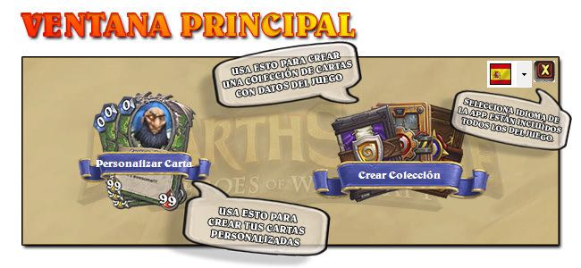
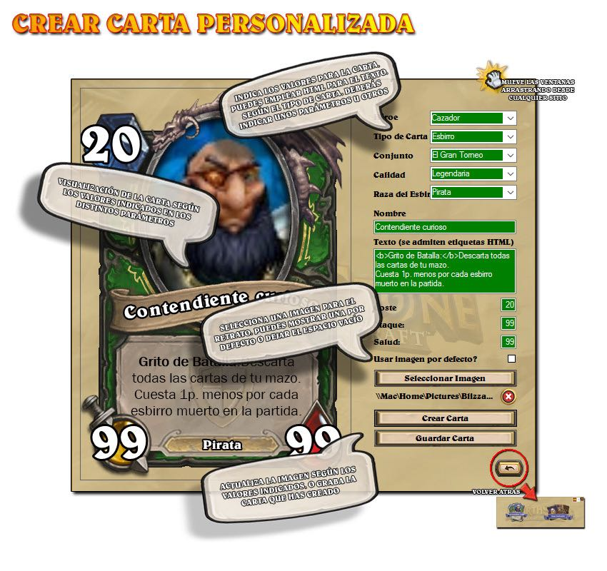
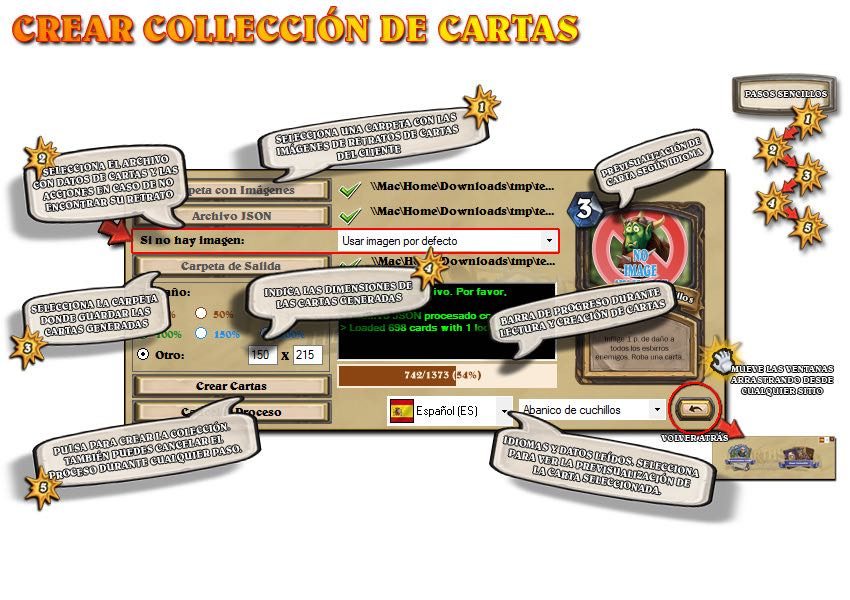
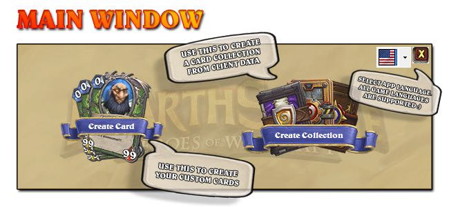
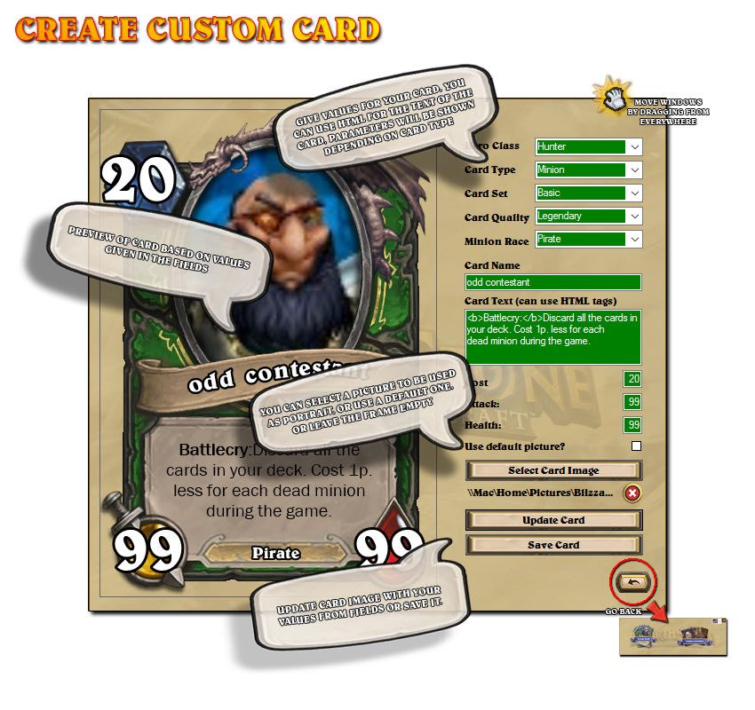
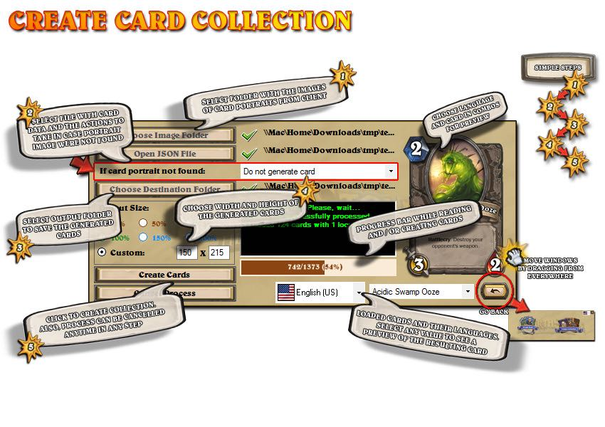

# HSCardGenerator

------------------------------------ 
        (Spanish / Español)* 
------------------------------------ 
* English version below

> ¿Qué es este programa?

Básicamente te permite hacer dos cosas: crear cartas personalizadas de HearthStone y crear colecciones de cartas del juego, en los idiomas que quieras. Es código libre distribuído bajo licencia MIT. [más info sobre licencia](LICENSE)

> Pero si hay un montón... ¿Para qué uno más?

Mi principal interés era crear las cartas del juego para usarlas en mi otra herramienta, Hearthstone Helper Tool. Como conseguir las imágenes de las cartas era un proceso tedioso, buscando imágenes en fansites y muchas veces llenas de marcas de agua (menudos egocéntricos), decidí hacer un programa que automatizara el proceso por mí y así conseguir todas las cartas. Algunos idiomas son muy difíciles de conseguir y de ahí la necesidad de tenerlos.
Como durante el proceso tuve que hacer muchas pruebas creando cartas, decidí dejar esa opción como una funcionalidad más, así que además de crear cartas de Hearthstone, puedes crearte las tuyas propias con tus imágenes y textos divertidos :)

> No está mal. ¿Qué necesito para todo esto?

Además del programa (puedes usar la versión compilada o crearlo tú mismo) necesitarás lo siguiente:

- Para crear cartas personalizadas: ingenio, humor, interés y alguna imagen molona para el retrato.
- Para crear colecciones de cartas del juego: las imágenes de los retratos (se pueden extraer de los archivos del juego con herramientas como Disunity) y un archivo con las definiciones de las cartas y los distintos idiomas. Concretamente, empleo los dos tipos de archivos provenientes de HearthstoneJson, tanto para un idioma concreto (AllSets.xxYY.json) como para toda la colección de cartas (AllSetsAllLanguages.json). El programa se encarga de leer el archivo, comprobar si existen las imágenes de los retratos y crear las cartas según las dimensiones que indiques y si se incluyen o no las cartas para las que falta el retrato.

> ¿Y es difícil de usar?

Espero que no. La interfaz no es una maravilla (no soy diseñador) y el programa lo hice lo más rápido posible, pero de la mejor manera que encontré, para tener lo que quería (cartas :D). Sin embargo, los procesos de creación de cartas son simples y he intentado que el propio programa te vaya guiando durante el proceso.

Para muestra, un botón:

Selecciona idioma de la aplicación (incluídos todos los del juego) y dos botones según tu interés.

Puedes seleccionar todo tipo de opciones de carta: tipo, clase, calidad, nombre, texto... Para el texto, emplea etiquetas HTML para resaltados (<b></b> para negrita o <i></i> para cursiva).
Puedes elegir una imagen para el retrato, dejar el hueco vacío o mostrar una imagen por defecto.
Al terminar, puedes guardar tu carta en formato PNG para usarla a tu gusto :)

En esta ventana se te irán pidiendo, paso a paso, los distintos elementos para crear la colección.

En primer lugar, una carpeta con todas las imágenes de los retratos. Las imágenes provienen del cliente del juego y tienen un nombre identificativo (AT_035.png, BRM_27.png, EX1_110.png...). Son imágenes de 512x512 y formato png, aunque las dimensiones pueden cambiar a gusto (eso si: el formato de archivo debe ser png). La mejor forma de conseguirlas es emplear Disunity con los assets del juego. Tienes más información sobre esa herramienta aquí: https://github.com/ata4/disunity

En segundo lugar, necesitas un archivo JSON con información de las cartas a crear. Los dos tipos de archivo que leerá el programa provienen de HearthstoneJson: https://github.com/Sembiance/hearthstonejson
O bien lees la colección para un idioma (AllSets.xxYY.json) o para todos los idiomas (AllSetsAllLanguages.json).
Debes indicar qué hacer si no se encuentra el retrato de alguna carta: o no crearla (ignorarla), crearla sin retrato (hueco vacío) o crearla con un retrato por defecto.

Una vez que lees la colección podrás visualizar las distintas cartas en la propia aplicación, empleando los dos desplegables que se muestran: uno para los idiomas y otro para las cartas leídas.

Por último, seleccionas una carpeta donde guardar la colección y las dimensiones de salida de las cartas. Las dimensiones de referencia son las del creador de carta personalizada: 380x550. A partir de ahí escoges tú un tamaño :)
Dentro de la carpeta de salida se crearán tantas carpetas como idiomas tengas en la colección y, dentro de cada una, las correspondientes cartas.

Hay algunos archivos de ejemplo en la carpeta "sample data".

IMPORTANTE: Sólo se generan *cartas coleccionables*. Las cartas especiales (de Aventuras, Pelea de Taberna...) no se tienen en cuenta. Si quieres crearlas, deberás modificar el código del programa donde se hace la comprobación del tipo de carta.

> Pues nada, habrá que probarlo.

Como dije, mi interés era hacerme con todas las cartas en todos los idiomas y, una vez hecho, no tengo problema en compartir con los demás mis herramientas y sus frutos :D Si ha sido útil para mí, espero que sea útil también para otros ^^

Hearthstone®: Heroes of Warcraft
©2014 Blizzard Entertainment, Inc. Todos los derechos reservados. Heroes of Warcraft es una marca, y Hearthstone es una marca registrada de Blizzard Entertainment, Inc. en los EE.UU. y/o en otros países.

------------------------------------
         (English / Inglés)
------------------------------------

> What is this program

Basically, it allows you to do two things: create customized Hearthstone cards and create card collections from the game, in the languages you want. It is open source under MIT license [more info on license](LICENSE)

> But there are lots of these... Why one more?

My main interest was to create all the game cards to use them in my other tool, Hearthstone Helper Tool. Gathering all pictures of cards was a tedious process (gathering  pictures in fansites, often cropped or full of watermarks -so egocentric from them-), so I decided to make a program that would automate the process from client data and to get all the cards by myself. Also, some languages are very difficult to obtain over the web and hence the need of having such a tool.
I had to do many tests by creating cards during the process, so I decided to keep that option as a feature in my tool.
So, besides creating Hearthstone card collections, you can create your own custom ones from your own images and funny texts :)

> Not bad. What do I need for this?

Besides the program (you can use the compiled version or compile it by yourself) you will need:

- To create customized cards: wit, interest, humor and any fancy image to be used as portrait :P
- To create collections of ingame cards: Images of portraits (you can extract the game files with tools like Disunity) and a JSON file with the information of cards and languages. In this case, you must use any of the both file types from HearthstoneJson: the one for a particular language (AllSets.xxYY.json) or the one with the entire collection of cards (AllSetsAllLanguages.json). The program will read the JSON file, check for images of portraits and create the cards according to the dimensions you choose. It also allows you to decide whether or not creating cards with missing portrait pictures, leaving an empty space instead or using a default picture.

> And is it hard to use?

I hope not. The interface is not great (I am not a designer *_*) and I did the program as quick as possible, but in the best way I found to get what I need (cards :D). However, the process of creating cards is simple and the program itself will guide you through the process.

The proof is in the pudding ^^:

You can select the language for the app. (all of the game are included) and a couple of buttons to do your stuff.

As you can see, you can customize any value for card properties (type, class, cost, texts...). Also, you can use HTML tags for card text (<b></b> does bold effect, <i></i> does italic effect, etc.).
You can choose a picture to be used as portrait, leave an empty space or to show a default picture.
At the end, you can save your card as a PNG file to do whatever you want later :)

In this window you will be asked for the elements needed to create the collection, step by step.

Firstly, a folder with all the images of the card portraits. The images come from the game client and have an identifying name (AT_035.png, BRM_27.png, EX1_110.png ...). They are 512x512 images and PNG format, although the dimensions can be changed as you wish (but the file format must be PNG in any case). The best way to get them is to use the Disunity tool in the asset files from the game. You have more information about this tool here: https://github.com/ata4/disunity

Secondly, you need a JSON file with information to create the cards. The two types of file that will read the program come from HearthstoneJson: https://github.com/Sembiance/hearthstonejson

Either you read the collection for a single language (AllSets.xxYY.json) or for all languages (AllSetsAllLanguages.json). In this step, you must specify what to do if the portrait of a card is not found: do not create it (ignore the card), to create it without portrait (leaving a transparent, empty space) or to use a default portrait.

Once you read the collection from the JSON file, you can preview all readed cards in the application itself, using the two dropdown comboboxes: one for card language and the other one for card info.

Finally, you must select a folder to save the card collection and choose the output dimensions of the cards. As reference, the default dimensions are the same as the custom card creator: 380x550. You can choose a new size starting from there :)

In the output folder, there will be created as many folders as languages has the collection. Within each folder, there will be saved the corresponding cards.

You have some example of source files into the "sample data" folder.

*IMPORTANT*: The program only generate *collectible cards*. Any other card not present in player collection (Adventures, Tabern brawls...) are not taken into account. If you want to create them, you must modify the source code where this check is done, and adapt it to your needs.

> Ok then, we'll try it

As I said, my goal was to get all the cards in all languages and, once I did it, I have no problem with sharing my tools with others :D If it was helpful for me, I hope it is also useful for others ^^

Hearthstone®: Heroes of Warcraft
©2014 Blizzard Entertainment, Inc. All rights reserved. Heroes of Warcraft is a trademark, and Hearthstone is a registered trademark of Blizzard Entertainment, Inc. in the U.S. and/or other countries.